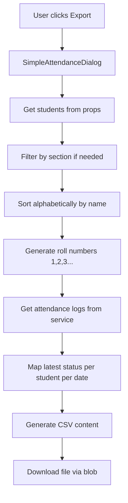

# 🔧 CSV Export Technical Implementation Guide

## 🚨 Critical Issues Discovered

### 1. Type Definition Mismatch
**Problem**: The service methods assume `Student` has a `sectionRollNumber` property, but it doesn't exist in the type definition.

```typescript
// ❌ CURRENT: Assumes this exists
student.sectionRollNumber

// ✅ ACTUAL: Student interface only has:
interface Student {
  id: number;
  name: string;
  admission_number: string;
  photo_url: string;
  section?: string; // Legacy field
  sections: string[]; // New multi-section support
  status: 'present' | 'absent' | 'washroom' | 'activity' | 'bunking';
  activity: string;
  timer_end: number | null;
  notes: string[];
  lastResetDate?: string;
}
```

### 2. Missing Firebase Service Import
**Problem**: `firebaseService` is used but not imported in `googleSheets.ts`.

### 3. Broken Multi-Date Export Logic
**Problem**: Fixed the main logic issue, but TypeScript errors prevent compilation.

## 📋 Current Working Implementations

### ✅ Dialog-Level Exports (Working)
The `SimpleAttendanceDialog.tsx` implementations are actually working because they:

1. **Generate roll numbers dynamically**:
```typescript
const studentsWithRollNumbers = studentsToExport.map((student, index) => ({
  ...student,
  sectionRollNumber: index + 1  // Dynamic generation
}));
```

2. **Use correct data flow**:
```typescript
// Get students from props (already loaded)
let studentsToExport = students;

// Filter by section
if (section && section !== 'All') {
  studentsToExport = students.filter(student => student.section === section);
}

// Sort alphabetically
studentsToExport.sort((a, b) => a.name.localeCompare(b.name));
```

### 🚨 Service-Level Exports (Broken)
The service methods are broken because they assume:
- `sectionRollNumber` exists on Student objects
- `firebaseService` is available
- Students are pre-sorted by roll number

## 🔄 Recommended Fix Strategy

### Option 1: Fix Service Methods (Recommended)
Update the service to work like the dialog:

```typescript
// In googleSheets.ts
async exportAttendanceToCSV(startDate: string, endDate: string, section?: string): Promise<string> {
  try {
    // Get students using existing method
    const allStudents = await this.getStudents();
    
    // Filter by section if specified  
    let studentsToExport = allStudents;
    if (section && section !== 'All') {
      studentsToExport = allStudents.filter(student => 
        student.section === section || 
        (student.sections && student.sections.includes(section))
      );
    }

    // Sort alphabetically by name
    studentsToExport.sort((a, b) => a.name.localeCompare(b.name));

    // Generate dynamic roll numbers
    const studentsWithRollNumbers = studentsToExport.map((student, index) => ({
      ...student,
      dynamicRollNumber: index + 1
    }));

    // ... rest of implementation
  } catch (error) {
    console.error('Failed to export attendance to CSV:', error);
    throw error;
  }
}
```

### Option 2: Extend Student Interface
Add `sectionRollNumber` to the Student type:

```typescript
// In types/index.ts
export interface Student {
  id: number;
  name: string;
  admission_number: string;
  photo_url: string;
  section?: string;
  sections: string[];
  status: 'present' | 'absent' | 'washroom' | 'activity' | 'bunking';
  activity: string;
  timer_end: number | null;
  notes: string[];
  lastResetDate?: string;
  sectionRollNumber?: number; // Add this field
}
```

**Pros**: Service code works as-is  
**Cons**: Requires database migration and changes throughout the app

## 📊 Working CSV Export Flow Analysis

Based on the code review, here's how CSV export actually works:

### Current Working Flow (Dialog-Based)


### Data Structure in Working Implementation
```typescript
// Input: students prop (from App component)
const students: Student[] = [
  { id: 123, name: "Alice Johnson", section: "A", ... },
  { id: 124, name: "Bob Smith", section: "A", ... }
];

// Processing: Dynamic roll number generation
const studentsWithRollNumbers = studentsToExport.map((student, index) => ({
  ...student,
  sectionRollNumber: index + 1  // 1, 2, 3, 4...
}));

// Output: CSV format
"Roll Number","Student Name","27/07/2025"
"1","Alice Johnson","P"  
"2","Bob Smith","A"
```

## 🎯 Immediate Action Plan

### Phase 1: Make Service Methods Work (1 hour)
1. **Fix the broken exportAttendanceToCSV method**:
   - Remove dependency on `sectionRollNumber` property
   - Generate roll numbers dynamically like dialog does
   - Fix import issues

2. **Add proper error handling**:
   - Validate date ranges
   - Handle empty student lists
   - Provide meaningful error messages

### Phase 2: Consolidate Logic (2 hours)  
1. **Move dialog logic to service**:
   - Create unified export methods in service
   - Remove duplicate logic from dialog
   - Update dialog to call service methods

2. **Create proper interfaces**:
   - Define CSVExportOptions type
   - Add CSVRow interface
   - Improve type safety

### Phase 3: Testing & Validation (1 hour)
1. **Test all scenarios**:
   - Single date export
   - Multi-date export  
   - Section filtering
   - Edge cases (no data, invalid dates)

## 💡 Key Insights from Analysis

### Why Dialog Implementation Works
1. **No assumptions about roll numbers** - generates them dynamically
2. **Uses already-loaded student data** - no additional Firebase calls
3. **Handles section filtering correctly** - supports both old and new section formats
4. **Proper error handling** - validates date ranges and handles edge cases

### Why Service Implementation is Broken
1. **Assumes sectionRollNumber exists** - causes TypeScript errors
2. **Missing imports** - firebaseService not available
3. **Incomplete logic** - attendance values not actually added to CSV rows
4. **Inefficient data flow** - makes unnecessary Firebase calls

## 🔍 Code Quality Issues Found

### 1. Inconsistent Section Handling
```typescript
// Dialog: Handles both formats
student.section === section || 
(student.sections && student.sections.includes(section))

// Service: Only handles new format
student.sections && student.sections.includes(section)
```

### 2. Redundant Data Fetching
```typescript
// Dialog: Uses passed students prop (efficient)
let studentsToExport = students;

// Service: Re-fetches from Firebase (inefficient)  
const allStudents = await this.getStudents();
```

### 3. Different Roll Number Strategies
```typescript
// Dialog: Dynamic generation (flexible)
sectionRollNumber: index + 1

// Service: Assumes pre-existing property (rigid)
student.sectionRollNumber
```

## 🏁 Final Recommendations

### Immediate (Today)
1. **Keep using dialog-based exports** - they work correctly
2. **Document the service issues** - for future reference
3. **Add error boundaries** - to handle edge cases gracefully

### Short-term (This Week)
1. **Fix service methods** using dialog logic as reference
2. **Remove duplicate code** once service is working
3. **Add unit tests** for CSV generation logic

### Long-term (Next Sprint)
1. **Standardize data flow** - single source of truth
2. **Add TypeScript interfaces** - improve type safety
3. **Performance optimization** - reduce redundant operations

---

The CSV export functionality is working well at the UI level, but the service layer needs significant fixes before it can be used reliably.

*Technical analysis completed: July 27, 2025*
